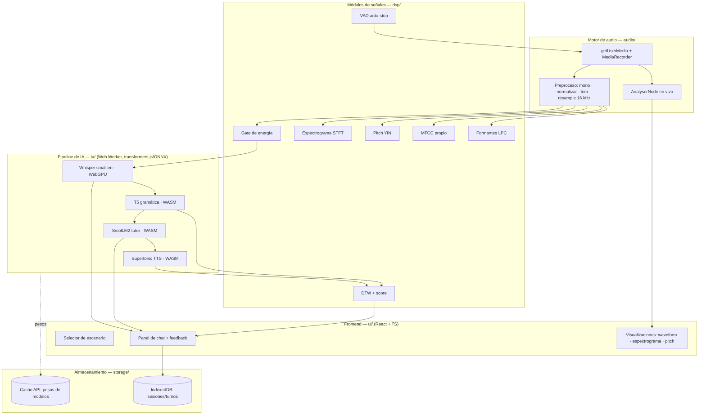
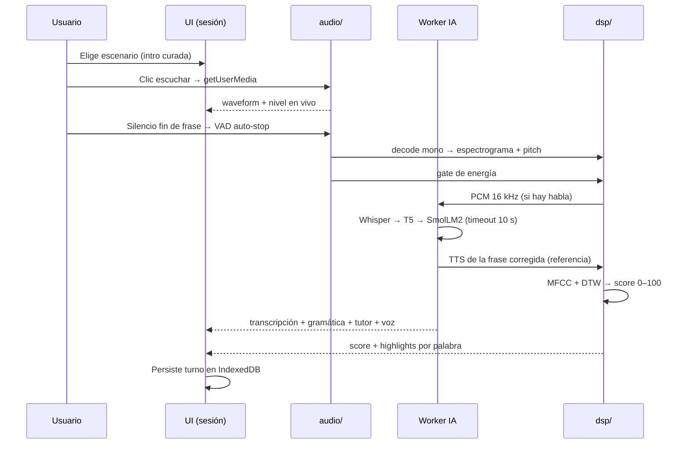

# My Personal English Teacher — Documento técnico

**Curso:** Señales y Sistemas · **Entrega:** Final (Semana 10)
**Producto:** PWA offline para práctica conversacional de inglés con
procesamiento digital de señales de voz e IA client-side.
**Repositorio:** `JoseJahel/my-personal-english-teacher`

> Documento redactado en Markdown versionable (diffs legibles, edición en
> ramas) y exportable a PDF. Las ecuaciones usan notación LaTeX/KaTeX y los
> diagramas están descritos en Mermaid, renderizados en el pipeline
> Markdown→PDF. Sigue la estructura obligatoria del enunciado del curso.

## Índice

1. [Descripción del problema](#1-descripción-del-problema)
2. [Justificación](#2-justificación)
3. [Arquitectura propuesta a nivel macro](#3-arquitectura-propuesta-a-nivel-macro)
4. [Objetivos](#4-objetivos)
5. [Marco teórico](#5-marco-teórico)
6. [Matriz de trazabilidad de requerimientos](#6-matriz-de-trazabilidad-de-requerimientos)
7. [Desarrollo y verificación de funcionalidades](#7-desarrollo-y-verificación-de-funcionalidades)
8. [Anexos](#8-anexos)

---

## 1. Descripción del problema

Aprender a hablar inglés es, para un hispanohablante, sobre todo un problema de
**práctica oral**. Las barreras principales no son de vocabulario sino de
producción: **pronunciación** (fonemas inexistentes en español, acento,
entonación), **gramática** en tiempo real y **fluidez** conversacional. La
práctica efectiva exige un interlocutor que dé retroalimentación inmediata, algo
que la mayoría de los estudiantes no tiene de forma accesible ni continua.

Las soluciones existentes suelen depender de servidores remotos: envían el audio
del usuario a la nube para reconocerlo y evaluarlo. Eso introduce **latencia**,
**costo**, **dependencia de conexión** y **preocupaciones de privacidad** (la voz
es un dato biométrico). Para un entorno educativo con conectividad variable, una
solución **offline y local** es más robusta y accesible.

Desde la perspectiva de **Señales y Sistemas**, evaluar pronunciación es un
problema de **procesamiento digital de la señal de voz**: la voz es una señal
no estacionaria, contaminada por **ruido**, con **variabilidad acústica** entre
hablantes (el mismo fonema tiene distinto F0 y formantes según el tracto vocal).
Medir "qué tan bien se pronunció" requiere extraer **características acústicas**
(energía, pitch, formantes, MFCC) y compararlas contra una referencia con una
métrica que tolere diferencias de **ritmo** entre locutores.

## 2. Justificación

- **Importancia educativa.** Un tutor que corrige pronunciación y gramática al
  instante, disponible sin conexión, baja la barrera de práctica oral, que es
  el cuello de botella real del aprendizaje, complementado por un modo de
  estudio con repetición espaciada para consolidar vocabulario y gramática
  entre sesiones de práctica oral.
- **Accesibilidad y costo.** Al correr **100% en el navegador** del estudiante
  (edge AI), no hay servidores que pagar ni mantener, funciona **sin internet**
  tras la carga inicial y **no expone la voz** del usuario a terceros.
- **Aplicación directa del curso.** El corazón del producto —comparar
  pronunciación— es procesamiento de señales: muestreo, análisis espectral
  (FFT/espectrograma), extracción de características (MFCC, pitch por YIN,
  formantes) y alineación temporal (DTW). El proyecto materializa la teoría del
  curso en una aplicación real.
- **Relevancia en TI.** Combina dos tendencias vigentes: **PWAs** (apps web
  instalables y offline) e **inferencia en el borde** (modelos de IA corriendo
  en el dispositivo del usuario vía WebAssembly/WebGPU), sin backend.

**Necesidad de usuario.** El usuario objetivo es un hispanohablante que aprende
inglés y necesita entender la retroalimentación: por eso la **interfaz está en
español** y el contenido de práctica en inglés.

## 3. Arquitectura propuesta a nivel macro

La aplicación se organiza en **capas con dependencia hacia adentro**: la
presentación (`ui/`) y la orquestación dependen del dominio, pero el dominio de
señales (`dsp/`) y de modelos (`ia/`) no conoce React ni el DOM. El diagrama de
bloques del enunciado (frontend, motor de audio, pipeline de IA, almacenamiento,
módulos de señales) mapea directamente sobre estas carpetas de `app/src/`.



**Flujos de datos.** El audio del micrófono se bifurca en dos ramas: una a tasa
nativa para **visualización en vivo** (Web Audio `AnalyserNode`) y otra que, tras
detener la captura, se **preprocesa** (mono → normalización → trim → resample a
16 kHz) y pasa por el **gate de energía** antes de llegar a Whisper. La
transcripción alimenta la corrección gramatical (T5), y la frase corregida
alimenta tanto al **tutor** (SmolLM2, con respaldo de reglas) como al **score de
pronunciación** (referencia TTS Supertonic vs. el audio del usuario, comparados con
MFCC + DTW). Toda la inferencia corre en un **Web Worker** para no bloquear la
UI. Los pesos de los modelos se cachean con la **Cache API** (gestionada por
transformers.js); las sesiones y turnos se guardan en **IndexedDB** (sin audio
crudo).

**Sexta capa: `study/`.** Además del ciclo de práctica conversacional, el
producto incluye un módulo de estudio autónomo como capa de dominio puro (sin
React, DOM, `ui/`, `ia/`, `audio/` ni `storage/`, igual que `dsp/`). Su
pipeline de contenido parte de 36 lecciones en Markdown con frontmatter YAML
(`study/procesado/*.md`), que `load-processed-lessons.ts` importa en build
time (`import.meta.glob`) y `parse-lesson-markdown.ts` convierte en
`StudyDocument`/`StudySection`; `group-study-blocks.ts` y
`extract-practice-items.ts` derivan de ahí el banco de práctica
(`practice-bank.ts`) con cuatro modalidades (vocabulario, completar, traducir,
transformar) y repetición espaciada tipo SM-2 (`practice-srs.ts`). La UI vive
en `ui/StudyScreen.tsx` y afines, accesible desde el hash `#estudio`; la
persistencia usa una tercera base IndexedDB (`storage/study-document-store.ts`),
junto a la de sesiones de práctica y la del banco de pruebas ASR.

**Tecnologías clave:** React + TypeScript + Vite; `@huggingface/transformers`
(ONNX Runtime Web) con **WebGPU** oportunista y fallback a **WASM**; Web Audio
API + MediaRecorder; `vite-plugin-pwa` (Service Worker del app shell); Vitest.
El detalle de esta guía por sprints iterativos está en la §7.

## 4. Objetivos

### General

Desarrollar una aplicación web **offline** para práctica conversacional de
inglés que integre **procesamiento digital de señales de voz** e **IA
client-side**, dando retroalimentación de pronunciación y gramática en el propio
navegador.

### Específicos (medibles)

1. **O-1.** Reconocer voz en inglés en el navegador con **WER ≤ 0.05** sobre el
   banco de fixtures de referencia (logrado: `whisper-small.en`, WER 0.000).
2. **O-2.** Corregir gramática post-utterance con un modelo T5 cuantizado
   corriendo en WASM.
3. **O-3.** Extraer **MFCC** de implementación propia (13 coeficientes, ventana
   Hann 25 ms, hop 10 ms, 40 filtros mel).
4. **O-4.** Estimar **pitch** con el algoritmo **YIN** en la banda 70–400 Hz.
5. **O-5.** Calcular un **score de pronunciación 0–100** comparando al usuario
   contra una referencia TTS mediante **DTW + distancia euclidiana** sobre MFCC.
6. **O-6.** Visualizar **waveform, espectrograma y contorno de pitch** de cada
   utterance.
7. **O-7.** Operar **offline** como PWA instalable tras cachear los modelos.
8. **O-8.** Sostener una **conversación guiada por escenarios** con un modelo
   generativo ligero (SmolLM2) y respaldo determinista veraz.

### De aprendizaje

Demostrar competencias del curso: teoría de muestreo (Nyquist), análisis
espectral (DFT/STFT), extracción de características (MFCC), detección de pitch,
alineación temporal (DTW) y su implementación práctica con la Web Audio API y
runtimes de inferencia en el navegador.

## 5. Marco teórico

### 5.1 Muestreo y Nyquist

La voz se captura y se **remuestrea a** $f_s = 16\text{ kHz}$ mono, suficiente
para el habla (energía relevante por debajo de ~8 kHz). El teorema de muestreo
exige $f_s \ge 2 f_{\max}$ para evitar *aliasing*:

$$ f_s \ge 2 f_{\max} $$

La captura sigue a la tasa **nativa** del dispositivo (no se fuerza
`sampleRate` en `getUserMedia`). El paso a 16 kHz es un FIR de **fase lineal**
(sinc ventaneado con Hann, $N=93$ a la tasa de entrada) en
`dsp/polyphase-resample.ts`:

- $48\,\text{kHz}\to 16\,\text{kHz}$: decimación entera $\times 3$ (3 fases, 31
  MAC/entrada).
- $44.1\,\text{kHz}\to 16\,\text{kHz}$: racional $160/441$ (no se trata 44.1
  como 48). 93 MAC/salida, no los 14 880 del prototipo a tasa alta.

Corte $7.2\,\text{kHz}$ (Nyquist destino $=8\,\text{kHz}$). Un tono de 12 kHz
queda $\ge 50\,\text{dB}$ por debajo; el interpolador lineal del Avance 1 lo
deja pasar casi entero (0 dB a 48 kHz). Cifras y retardo de grupo (~1 ms) en
`reporte-verificacion.md` §5.5. Otras tasas caen al interpolador lineal
documentado.

Tras el remuestreo, user y referencia TTS comparten un **pasa-banda**
Butterworth de segundo orden (cascada HP $80\,\text{Hz}$ + LP $7.5\,\text{kHz}$,
biquads RBJ, issue #73) en `dsp/biquad-voice-bandpass.ts`. Una pasada causal:
ganancia medida $-3.01\,\text{dB}$ en ambos cortes y $-24.1\,\text{dB}$ a
$20\,\text{Hz}$ (`reporte-verificacion.md` §5.7). No es filtrado adaptativo
(#63).

### 5.2 Transformada Discreta de Fourier (DFT) y espectrograma

El análisis espectral parte de la **DFT** de una trama de $N$ muestras:

$$ X[k] = \sum_{n=0}^{N-1} x[n]\, e^{-j\,2\pi kn/N}, \qquad k = 0,1,\dots,N-1 $$

El **espectrograma** es la magnitud (en escala log) de la **STFT**: la DFT
aplicada por tramas ventaneadas (ventana de Hann $w[n]$) con solape:

$$ S[m,k] = \left| \sum_{n=0}^{N-1} x[n + mH]\, w[n]\, e^{-j\,2\pi kn/N} \right| $$

donde $H$ es el *hop* entre tramas. Implementado en `dsp/spectrogram.ts`.

### 5.3 MFCC

Los **Mel-Frequency Cepstral Coefficients** resumen la envolvente espectral tal
como la percibe el oído. El cálculo (en `dsp/mfcc-extraction.ts`):

1. **Pre-énfasis:** $y[n] = x[n] - \alpha\,x[n-1]$, con $\alpha = 0.97$.
2. **Ventaneo** (Hann, 25 ms) y **FFT**; potencia $|X[k]|^2$.
3. **Banco de filtros mel** ($M = 40$), con la escala mel:

$$ m(f) = 2595 \,\log_{10}\!\left(1 + \frac{f}{700}\right) $$

4. **Log-energía** por banda mel: $E_j = \log \sum_k H_j[k]\,|X[k]|^2$.
5. **DCT-II** para decorrelacionar y quedarse con los primeros 13 coeficientes:

$$ c_i = \sum_{j=0}^{M-1} E_j \cos\!\left[\frac{\pi i}{M}\left(j + \tfrac{1}{2}\right)\right], \quad i = 0,\dots,12 $$

Convención HTK de este repo (issue #94): el banco no se normaliza al estilo
Slaney; \(c_0\) se conserva; \(|X[k]|^2\) **no** se divide por \(N^2\) ni se
pasa a `log10` antes del banco (eso es el espectrograma de UI). Invariante
en `dsp/mfcc-chain-audit.test.ts`.

### 5.4 Detección de pitch: YIN

**YIN** refina la autocorrelación usando la **función de diferencia**:

$$ d_\tau(t) = \sum_{n=1}^{W} \big(x[n] - x[n+\tau]\big)^2 $$

y su versión **normalizada acumulada**, que reduce los errores de octava:

$$ d'_\tau(t) = \begin{cases} 1 & \tau = 0 \\[4pt] \dfrac{d_\tau(t)}{\frac{1}{\tau}\sum_{j=1}^{\tau} d_j(t)} & \tau > 0 \end{cases} $$

Se elige el primer $\tau$ bajo un umbral absoluto; $F_0 = f_s / \tau$.
Implementado en `dsp/pitch-detection-yin.ts` (banda 70–400 Hz).

### 5.5 Comparación de pronunciación: DTW + distancia euclidiana

Dos locutores no hablan al mismo ritmo, así que una distancia trama a trama
directa penaliza el **tempo** en vez de la pronunciación. **Dynamic Time
Warping** alinea las dos secuencias de MFCC minimizando el costo acumulado con la
recurrencia:

$$ D(i,j) = d(i,j) + \min\{\,D(i-1,j),\; D(i,j-1),\; D(i-1,j-1)\,\} $$

donde el costo local es la **distancia euclidiana** entre vectores de features:

$$ d(i,j) = \left\| \mathbf{c}_i^{\,\text{user}} - \mathbf{c}_j^{\,\text{ref}} \right\|_2 = \sqrt{\sum_{p} \left(c_{i,p}^{\text{user}} - c_{j,p}^{\text{ref}}\right)^2} $$

Como la referencia es sintética (Supertonic), las features se **normalizan por
locutor** (contornos de pitch relativos, z-score por enunciado) para que la
distancia mida pronunciación y no identidad de voz. El costo acumulado se mapea a
un **score 0–100** (`dsp/dynamic-time-warping.ts` + `dsp/pronunciation-score.ts`).

**Tasa de trabajo del score.** La comparación se hace siempre a
$f_s = 16\text{ kHz}$: la referencia TTS (44.1 kHz en Supertonic) se
remuestrea con el mismo FIR de fase lineal racional $160/441$ de la §5.1 antes
de pasar por el pasa-banda de voz compartido con el usuario (issue #73), en vez
de heredar la tasa nativa del sintetizador. La razón es que el banco de 40
filtros mel (§5.3) y el pasa-banda deben cubrir el mismo rango: a 44.1 kHz el
banco se repartiría de 0 a 22.05 kHz mientras el pasa-banda corta en 7.5 kHz,
dejando cerca de una docena de filtros mel por encima del corte, pegados al
suelo logarítmico. Como la DCT-II (§5.3) mezcla todas las bandas mel en cada
coeficiente, ese desajuste correría los 13 MFCC completos y las constantes de
calibración (distancia MFCC a media escala 16.5; pesos del score combinado 0.68
MFCC / 0.18 pitch / 0.07 energía / 0.07 formantes) dejarían de aplicar. Fijar la
tasa de trabajo a 16 kHz preserva esa alineación entre banco mel y banda
pasante (`ui/run-pronunciation-scoring.ts`).

### 5.6 Word Error Rate (WER)

La precisión del ASR se mide con **WER**, la distancia de edición de Levenshtein
a nivel de palabra:

$$ \text{WER} = \frac{S + D + I}{N} $$

con $S$ sustituciones, $D$ eliminaciones, $I$ inserciones y $N$ palabras de la
referencia (`ia/word-error-rate.ts`).

### 5.7 IA y modelos en el navegador

`transformers.js` ejecuta modelos en formato **ONNX** sobre **ONNX Runtime Web**
(backends **WASM** y **WebGPU**). La **cuantización** (p. ej. pesos int8/q8)
reduce tamaño y memoria a cambio de algo de precisión en Whisper, T5 y SmolLM2.
El TTS (**Supertonic**, tres sesiones ONNX encadenadas —*text encoder* →
*latent denoiser* → *voice decoder*— que decodifican la forma de onda sin
vocoder externo) solo existe en fp32, pero su huella (~250.7 MB) queda
igualmente dentro del presupuesto del navegador, de hecho muy por debajo de los
~613 MB del TTS anterior (`speecht5_tts` + vocoder `speecht5_hifigan`). La app
ancla cada modelo a un **commit SHA** del Hub de Hugging Face para builds
reproducibles (`ia/model-registry.ts`). El ASR prefiere **WebGPU** por latencia;
el resto corre en **WASM** para evitar kernels inestables.

## 6. Matriz de trazabilidad de requerimientos

La matriz completa (ID, descripción, prioridad, fuente, módulo, estado, pruebas,
métricas) está en un documento aparte, versionado junto a este:

➡️ **[matriz-trazabilidad.md](./matriz-trazabilidad.md)**

Resumen de cobertura: el núcleo funcional del enunciado (ASR, gramática,
análisis DSP de pronunciación, score, tutor, TTS, visualizaciones, offline) está
implementado y verificado. Las sugerencias de comunicación (RF-14) pasaron de
ir embebidas en la respuesta del tutor a una salida diferenciada con panel
propio (`CommunicationSuggestionsPanel.tsx`) y quedan como Implementado. La
matriz incorpora además los requerimientos del modo de estudio (lecciones,
banco de práctica en cuatro modalidades, repetición espaciada, marcapáginas),
funcionalidad adicional mergeada en `main` que no formaba parte del alcance
original del enunciado. El detalle de estado (Implementado / Parcial /
Pendiente / Descartado) por requerimiento está en el documento de la matriz.

## 7. Desarrollo y verificación de funcionalidades

### 7.1 Metodología y plan de desarrollo

Desarrollo **iterativo (Agile-like)** en tres hitos (Avance 1 / Avance 2 /
Entrega Final), con integración a `main` vía **Pull Requests** por rama personal
y **CI** obligatorio (lint, typecheck, test, build). La construcción es
**modular** por capa de `app/src/` (`audio/`, `dsp/`, `ia/`, `ui/`, `storage/`),
de modo que cada módulo se desarrolla e integra de forma incremental. Herramientas:
VS Code, Git/GitHub, pnpm, Vitest, GitHub Actions.

### 7.2 Verificación

El detalle de casos de prueba, métricas (WER, latencia) y edge cases está en:

➡️ **[reporte-verificacion.md](./reporte-verificacion.md)**

Puntos clave: **suite de 798 casos en 123 archivos** (Vitest) en verde en el
CI; **WER 0.000** de `whisper-small.en` sobre las fixtures de referencia
(bench 2026-07-29); latencia de ASR ~3.4 s/frase en WebGPU (limitación conocida
frente al objetivo de 2 s, decisión que prioriza precisión). El DSP local
(gate, espectrograma, pitch, score) opera holgadamente por debajo de 2 s.

### 7.3 Flujo operativo de la demo



## 8. Anexos

### 8.1 Estructura del repositorio (capas)

| Capa | Rol | Ejemplos de archivos |
|------|-----|----------------------|
| `ui/` | Presentación React, escenarios, chat, sesión, visualizaciones | `HomeScreen.tsx`, `use-home-screen-session.ts`, `waveform-canvas.ts` |
| `ia/` | Modelos en worker (ASR/gramática/TTS/tutor), registro, WER | `inference-worker.ts`, `model-registry.ts`, `word-error-rate.ts` |
| `dsp/` | Dominio de señales puro | `mfcc-extraction.ts`, `pitch-detection-yin.ts`, `dynamic-time-warping.ts` |
| `audio/` | Captura, resample, reproducción | `open-microphone-stream.ts`, `audio-resampler.ts` |
| `storage/` | IndexedDB de sesiones + fixtures del banco (dev) | `session-repository.ts`, `database-schema.ts` |
| `study/` | Dominio puro de contenido de estudio: lecciones, banco de práctica y repetición espaciada (sin React/DOM) | `load-processed-lessons.ts`, `parse-lesson-markdown.ts`, `practice-srs.ts` |

### 8.2 Extracto de código: función de WER

```ts
// ia/word-error-rate.ts (extracto conceptual)
// WER = (S + D + I) / N  — Levenshtein a nivel de palabra tras normalizar
export function computeWordErrorRate(reference: string, hypothesis: string): WordErrorRateResult {
  const ref = normalizeForWordErrorRate(reference)   // minúsculas, sin puntuación
  const hyp = normalizeForWordErrorRate(hypothesis)
  // ... matriz de edición + backtracking cuenta S, D, I ...
}
```

### 8.3 Modelos activos (anclados a SHA)

| Rol | Modelo Hugging Face | Backend |
|-----|---------------------|---------|
| ASR (default) | `Xenova/whisper-small.en` | WebGPU → WASM |
| Gramática | `Xenova/t5-base-grammar-correction` | WASM |
| TTS | `onnx-community/Supertonic-TTS-ONNX` @ `cff123c` (sin vocoder aparte) | WASM |
| Tutor | `HuggingFaceTB/SmolLM2-360M-Instruct` | WASM |

El TTS (Supertonic) encadena tres sesiones ONNX —*text encoder* → *latent
denoiser* → *voice decoder*— que generan la forma de onda directamente, sin el
vocoder separado (`speecht5_hifigan`) ni el *speaker embedding* de demo
genérico que usaba el modelo anterior; la voz activa (`F1`) es un vector de
estilo precomputado por locutor.

### 8.4 Kit de defensa local (issue #97)

Artefactos orales de aula, versionados junto a este documento. **No** sustituyen
el deck de 10–15 min (issue #64) ni la bitácora de evidencias (issue #71):

- [matriz-riesgos.md](./matriz-riesgos.md) — riesgos reales (WebGPU, 1 GB,
  mic sordo, score vs locutor) con dueño y mitigación local.
- [preguntas-defensa.md](./preguntas-defensa.md) — Q&A DSP/IA con cifra o
  path de este repo, más el **plan B 100 % local** (`pnpm preview`,
  `#shell-preview*`, `dev:latency`). Sin host cloud.

### 8.5 Bibliografía y recursos

- Documentación de `@huggingface/transformers` (transformers.js) y ONNX Runtime Web.
- MDN Web Docs: Web Audio API, MediaStream/MediaRecorder, Service Workers/PWA.
- Oppenheim, A. V. & Schafer, R. W. *Discrete-Time Signal Processing*
  (decimación, fase lineal, bancos polifásicos).
- De Cheveigné, A. & Kawahara, H. (2002). *YIN, a fundamental frequency
  estimator for speech and music.* JASA.
- Davis, S. & Mermelstein, P. (1980). *Comparison of parametric representations
  for monosyllabic word recognition* (MFCC).
- Sakoe, H. & Chiba, S. (1978). *Dynamic programming algorithm optimization for
  spoken word recognition* (DTW).
- Hugging Face Hub (modelos filtrados por compatibilidad con transformers.js).

---

*Documentos hermanos: [matriz-trazabilidad.md](./matriz-trazabilidad.md) ·
[reporte-verificacion.md](./reporte-verificacion.md) ·
[matriz-riesgos.md](./matriz-riesgos.md) ·
[preguntas-defensa.md](./preguntas-defensa.md). Este documento y sus
diagramas Mermaid/ecuaciones KaTeX se versionan en Markdown y se exportan a PDF
para la entrega.*
